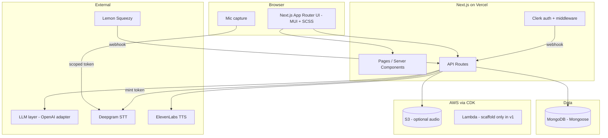
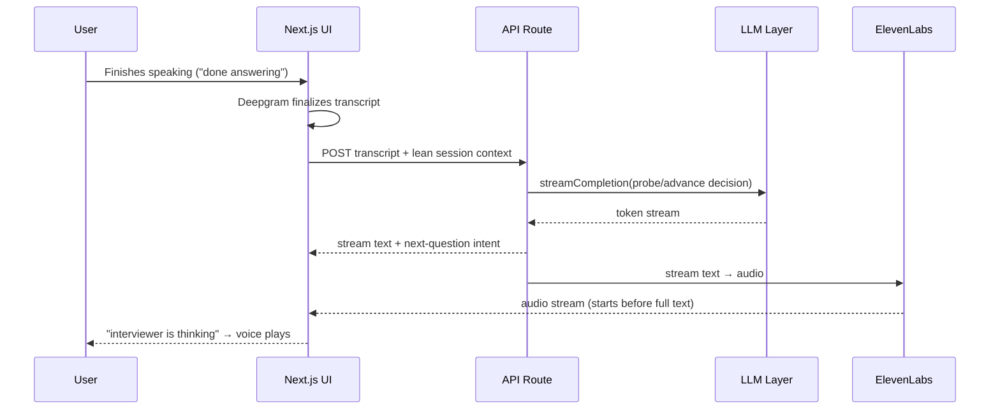
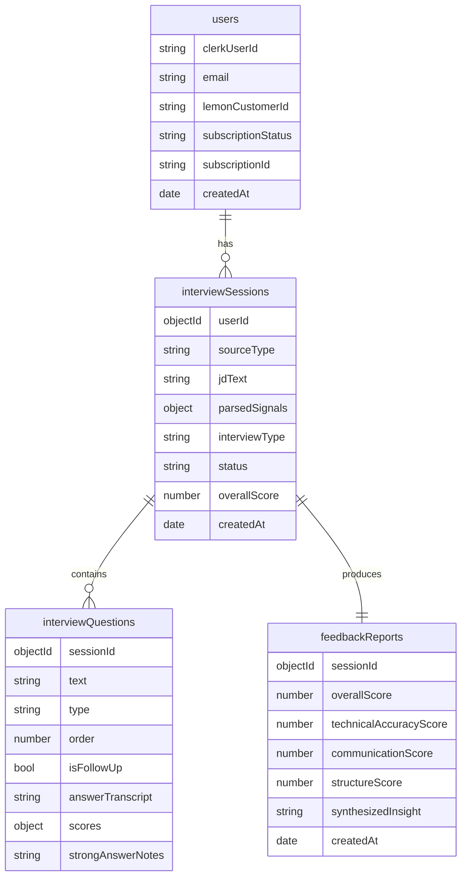

# Implementation Plan — AI Mock Interview SaaS (v1)

## Problem Statement

Build a working v1 of a web SaaS where software engineers practice spoken behavioral and architectural interviews with an AI interviewer. The product parses a job description, conducts a realistic voice interview (TTS questions + streaming STT answers + adaptive follow-ups), and produces a scored feedback report. Scope is deliberately small: voice-only, web-only, practice-only, single subscription tier, solo-maintainable.

## Requirements (from gathering)

- **Repo layout:** Single Git repo. Next.js at root, CDK app in `/infra`, shared types/schemas in `/lib` (importable by both).
- **Data access:** Mongoose ODM (schemas, validation, types in one place).
- **Lambda boundary:** Conservative. Scaffold CDK + S3 now; keep JD parsing, orchestrator, and feedback in Next.js API routes initially. Promote to Lambda only if latency/long-running work demands it.
- **Styling:** Material UI (components + theme) plus SCSS modules. No Tailwind.
- **Build order:** UI flow on mock data first, then wire real services.
- **Cross-cutting:** Provider-agnostic LLM layer (OpenAI first), lean per-turn prompts, streaming everywhere to mask latency, silent background scoring, cost-conscious API usage, boring/maintainable tools.

## Background / Research Notes

- **Clerk + App Router:** Current Clerk (core 2) uses `clerkMiddleware()` from `@clerk/nextjs/server` in `middleware.ts` (the older `authMiddleware` is deprecated). `<ClerkProvider>` wraps the root layout; `<SignIn />` / `<SignUp />` mount on catch-all routes. User sync is done via a webhook verified with Svix. (Confirm exact current package/API names against Clerk's quickstart before coding, since they revise this often.)
- **Mongoose in serverless/Next.js:** Connections must be cached on a global to survive hot reloads and avoid connection storms. Standard pattern is a `dbConnect()` helper that memoizes the promise on `globalThis`.
- **MUI + Next.js App Router:** Requires `AppRouterCacheProvider` for correct SSR/streaming style flushing; theme provided via a client `ThemeProvider`. Next.js has built-in Sass support (`sass` package) for `.module.scss`.
- **Browser ↔ Deepgram security:** Do **not** ship the raw Deepgram API key to the browser. Use a server route that mints short-lived scoped Deepgram tokens (or proxy the audio). Same principle for ElevenLabs/OpenAI keys — all stay server-side.
- **Latency/cold starts:** Since the live turn loop stays in Next.js API routes (per decision), cold starts are less of an issue than Lambda; the main latency lever is streaming the LLM response into ElevenLabs so audio starts before the full text is ready.

## Proposed Solution — High-Level Architecture

## Data Model (Mongoose collections)

---

## Task Breakdown

Each task is a working, demoable increment. Tests use **Vitest + React Testing Library** (unit/component). Set up the test runner in Task 1 so every later task can lean on it.

### Phase 0 — Scaffold & Foundations

#### Task 1: Initialize the Next.js project and tooling ✅

- Objective: Create the single-repo Next.js app (App Router, TypeScript) at the root with linting, formatting, and a test runner.
- Guidance: `create-next-app` (TS, App Router, no Tailwind). Add ESLint + Prettier, `sass`, and Vitest + React Testing Library + jsdom. Establish `/lib` for shared code and a `.env.example` documenting every key (Clerk, Mongo, OpenAI, Deepgram, ElevenLabs, Lemon Squeezy, AWS).
- Tests: One trivial component test to prove the test harness runs.
- Demo: `npm run dev` serves a default page; `npm test` runs green.

#### Task 2: Material UI + SCSS styling foundation

- Objective: Wire MUI with App Router SSR support and SCSS modules.
- Guidance: Install `@mui/material`, `@emotion/react`, `@emotion/styled`, `@mui/material-nextjs`, `@mui/icons-material`. Add `AppRouterCacheProvider` in the root layout, a custom `ThemeProvider` (client component) with a basic theme (colors, typography), and a global `styles/` folder with a base `.scss`. Add a demo `.module.scss` on one component.
- Tests: Component test asserting a themed MUI component renders.
- Demo: A styled landing/placeholder page using both an MUI component and an SCSS module class.

#### Task 3: Clerk auth integration

- Objective: Add Clerk for sign-up/sign-in and route protection.
- Guidance: Install `@clerk/nextjs`. Wrap root layout in `<ClerkProvider>`, add `clerkMiddleware()` in `middleware.ts` with a public-routes matcher (landing, sign-in/up, webhooks), and add `/sign-in` + `/sign-up` catch-all pages. Create a protected `/dashboard` placeholder that redirects unauthenticated users. Confirm exact current Clerk APIs against their quickstart first.
- Tests: Middleware/route guard behavior where practical; otherwise a documented manual check.
- Demo: Sign up, land on a protected dashboard placeholder, sign out, get redirected.

### Phase 1 — Data Model & Infra Skeleton

#### Task 4: MongoDB connection + Mongoose models

- Objective: Establish a cached connection helper and define all four collections plus billing fields on `users`.
- Guidance: `dbConnect()` memoized on `globalThis`. Define Mongoose schemas for `users`, `interviewSessions`, `interviewQuestions`, `feedbackReports` matching the ER diagram (including Lemon Squeezy fields on `users`). Export inferred TS types from `/lib`. Add indexes (`clerkUserId` unique, `sessionId`, `userId`).
- Tests: Unit tests validating each schema accepts valid docs and rejects invalid ones (use `mongodb-memory-server`).
- Demo: A throwaway script/route inserts and reads back a sample session, proving the connection and schemas work.

#### Task 5: Clerk → MongoDB user sync webhook

- Objective: Keep a `users` doc in sync with Clerk via webhook.
- Guidance: `/api/webhooks/clerk` route verifying the Svix signature; handle `user.created`/`user.updated`/`user.deleted` by upserting/removing the `users` doc keyed on `clerkUserId`. Keep the route public in middleware.
- Tests: Unit test the handler with a signed sample payload (valid + tampered signature rejected).
- Demo: Creating a Clerk user produces a matching MongoDB `users` doc.

#### Task 6: CDK app skeleton (infra/)

- Objective: Scaffold the CDK app defining the S3 bucket and a placeholder Lambda + IAM, without moving live logic into Lambda yet.
- Guidance: `cdk init app --language typescript` in `/infra` with its own `package.json`. Define a private, encrypted S3 bucket for optional session audio (lifecycle/retention rule) and one stub Lambda (e.g. a health handler) with a least-privilege IAM role. Document `cdk synth`/`deploy`; deploy is optional at this stage.
- Tests: `cdk synth` succeeds; optionally a CDK assertions test that the stack contains the bucket + Lambda.
- Demo: `cdk synth` outputs a valid CloudFormation template with the bucket and Lambda defined.

### Phase 2 — UI Flow on Mock Data (all 7 screens)

#### Task 7: Mock data layer + shared view types

- Objective: Central mock data source so screens build before real APIs exist.
- Guidance: In `/lib/mock`, create fixtures for a parsed JD, a session, questions, and a feedback report, typed with the shared types from Task 4. Add a thin `dataProvider` interface so screens import from one place and can later swap mock → real with minimal churn.
- Tests: Type-level + a unit test that fixtures satisfy the shared schemas.
- Demo: Import a mock session in a test page and render its title.

#### Task 8: JD input + interview setup review screens

- Objective: Build screens 2 and 3 on mock data.
- Guidance: JD input page (paste textarea or pick a role/level preset). On submit, route to a setup-review page showing mock parsed signals (role, seniority, stack, culture), interview type (behavioral/architectural/mix), estimated length, and focus areas, with a "Start interview" CTA. MUI forms + SCSS layout.
- Tests: Component tests for form validation and that review renders mock signals.
- Demo: Paste a JD (or pick a preset) → see a populated setup-review screen → click Start.

#### Task 9: Mic check screen

- Objective: Build screen 4 — the trust-building audio check.
- Guidance: Request mic permission via `getUserMedia`, show a live input-level meter, and gate "Continue" until audio is detected. Handle denied-permission state gracefully.
- Tests: Component test with mocked media stream for the enabled/disabled continue states.
- Demo: Grant mic access, see the level meter respond, proceed.

#### Task 10: Live interview session screen (mock turn loop)

- Objective: Build screen 5 driving the turn loop from mock data — no real STT/LLM/TTS yet.
- Guidance: Display the current question (text; voice stubbed), a "listening" indicator, a simulated live-building transcript, an "interviewer is thinking" indicator, and a "done answering" control (no fixed timer). Advance through mock questions and mock follow-ups. Keep scoring invisible.
- Tests: Component tests for state transitions (asking → listening → thinking → next).
- Demo: Walk a full mock interview start to finish in the browser.

#### Task 11: Feedback report screen

- Objective: Build screen 6 on a mock report.
- Guidance: Overall score + one-line plain-English diagnosis, three sub-scores, the synthesized "focus on this next time" insight, a collapsible per-question breakdown color-coded by score, and two CTAs ("practice this gap again", "view all sessions").
- Tests: Component tests for score color-coding and collapsible behavior.
- Demo: View a fully rendered mock feedback report.

#### Task 12: Dashboard with session history + trend

- Objective: Build screen 7 on mock data and connect navigation end-to-end.
- Guidance: List past sessions with status/score and a score-trend chart (a boring, well-documented chart lib). Wire all screens into one navigable flow: dashboard → JD input → setup → mic check → session → feedback → back to dashboard.
- Tests: Component test for empty vs populated history.
- Demo: Click through the entire product flow on mock data without dead ends.

### Phase 3 — LLM Abstraction + JD Parsing

#### Task 13: LLM abstraction layer + OpenAI adapter

- Objective: Build the provider-agnostic interface and the first adapter.
- Guidance: Define `generateCompletion`, `generateStructuredOutput`, `streamCompletion` in `/lib/llm`. Shared output shapes defined once as Zod schemas. OpenAI adapter implements the interface (JSON mode / function calling for structured output). A single factory resolves the provider from `LLM_PROVIDER` once. Keep prompts provider-neutral. Keys stay server-side only.
- Tests: Unit tests against a mocked OpenAI client — structured output validated against the Zod schema; provider factory returns the right adapter.
- Demo: A test invokes `generateStructuredOutput` and gets schema-valid JSON back (mocked).

#### Task 14: Real JD parsing wired into the flow

- Objective: Replace mock parsed signals with a real LLM call.
- Guidance: `/api/jd/parse` calls `generateStructuredOutput` to extract role/seniority/stack/culture into the shared schema, persists to `interviewSessions`, and the setup-review screen reads real data. JD context used only here (not per turn), per cost rules.
- Tests: Handler test with a mocked LLM returning a fixture; assert persistence + schema validation.
- Demo: Paste a real JD → setup-review shows genuinely extracted signals.

### Phase 4 — Live Session Loop (real STT + orchestrator + TTS)

#### Task 15: Deepgram streaming STT with scoped tokens

- Objective: Real-time transcription in the session screen.
- Guidance: `/api/deepgram/token` mints a short-lived scoped token server-side (never expose the raw key). Browser opens a Deepgram WebSocket, streams mic audio, renders interim + final transcripts. On "done answering", capture the finalized transcript only (don't re-transcribe).
- Tests: Unit test the token route (mocked Deepgram); manual check for live transcription.
- Demo: Speak and watch an accurate live transcript build, then finalize.

#### Task 16: Interview orchestrator (probe vs advance) via LLM

- Objective: Real adaptive turn decisions.
- Guidance: `/api/session/turn` sends a lean payload — tight system prompt + conversation history + finalized transcript, **not** the full JD — to `streamCompletion`. The LLM returns the next question and a probe/advance/rescue decision. Persist each turn to `interviewQuestions`. Stream the response text out.
- Tests: Handler tests with mocked LLM for probe vs advance branches; assert lean payload (no full JD) and persistence.
- Demo: A spoken answer produces a context-aware follow-up or advances appropriately.

#### Task 17: ElevenLabs TTS streaming + full live loop integration

- Objective: Voice out, integrated with everything above.
- Guidance: Server route streams orchestrator text into ElevenLabs and pipes audio to the client so playback can begin before the full text is ready; show "interviewer is thinking" during the gap. Key stays server-side. Replace the mock turn loop in screen 5 with the real STT → orchestrator → TTS pipeline. Optionally persist audio to S3.
- Tests: Token/proxy route unit tests; manual latency check against the 2–3s target.
- Demo: A full real voice interview — hear questions, answer aloud, get adaptive follow-ups.

### Phase 5 — Feedback Generation

#### Task 18: Background scoring + feedback report generation

- Objective: Real scoring and the synthesized report.
- Guidance: Score each answer silently after submission (store per-question scores + strong-answer notes; never surface mid-interview). At session end, `/api/session/feedback` uses `generateStructuredOutput` over the whole transcript to produce overall + three sub-scores + a pattern-based synthesized insight, persisted to `feedbackReports` and `interviewSessions.overallScore`. Wire screen 6 and the dashboard trend to real data; make "practice this gap again" seed a new session weighted to the weak area.
- Tests: Handler test with mocked LLM asserting schema-valid report + persistence; test that scores never appear in the live-session response.
- Demo: Finish a real interview → get a genuine, schema-valid feedback report; weak-area CTA spawns a focused new session.

### Phase 6 — Payments

#### Task 19: Lemon Squeezy single-tier subscription + webhook sync

- Objective: One paid tier, end to end.
- Guidance: Checkout link/overlay for a single subscription product. `/api/webhooks/lemonsqueezy` verifies the signature and syncs `subscriptionStatus`/IDs onto the `users` doc. Gate interview creation on an active subscription; show subscription state in the dashboard.
- Tests: Webhook handler unit tests (valid + tampered signature; created/updated/cancelled states); gating logic test.
- Demo: Subscribe via test mode → status syncs to MongoDB → gated features unlock; cancel → access reflects it.

---

## Notes & Recommendations

- **Security:** No third-party key (OpenAI, Deepgram, ElevenLabs, Lemon Squeezy) ever reaches the browser. Deepgram uses scoped short-lived tokens; everything else is server-side. All three webhooks (Clerk, Lemon Squeezy) verify signatures.
- **Cost control:** Full JD only at parse + feedback; per-turn prompt stays lean; finalized transcripts are never re-transcribed; optional S3 audio is opt-in with a retention lifecycle.
- **Cold starts:** Live loop stays in Next.js API routes per decision, sidestepping Lambda cold-start risk. If you later promote the orchestrator to Lambda, revisit provisioned concurrency or keep-warm.
- **Sequencing:** Phases 0–2 give you a fully clickable product on mock data (your validation milestone) before any paid API is wired.
