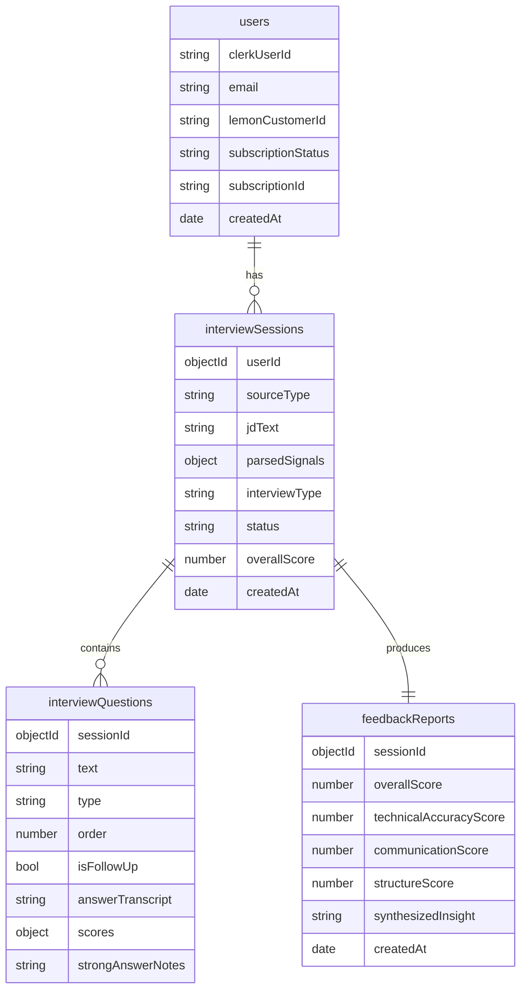

# Implementation Plan — AI Mock Interview SaaS (v1)

## Problem Statement

Build a working v1 of a web SaaS where software engineers practice spoken behavioral and architectural interviews with an AI interviewer. The product parses a job description, conducts a realistic voice interview (TTS questions + streaming STT answers + adaptive follow-ups), and produces a scored feedback report. Scope is deliberately small: voice-only, web-only, practice-only, single subscription tier, solo-maintainable.

## Requirements (from gathering)

- **Repo layout:** Single Git repo. Next.js at root, CDK app in `/infra`, shared types/schemas in `/lib` (importable by both). Backend logic organized into layers: `/lib/schemas` (Zod contracts), `/lib/repositories` (data access), `/lib/services` (business logic), `/lib/integrations` (3rd-party SDK wrappers), `/lib/llm` (LLM abstraction). Next.js API routes are thin HTTP handlers only — all logic they invoke is framework-agnostic and reusable by future clients (mobile, desktop, standalone API).
- **Data access:** Mongoose ODM (schemas, validation, types in one place).
- **Lambda boundary:** Conservative. Scaffold CDK + S3 now; keep JD parsing, orchestrator, and feedback in the service layer (called by Next.js API routes initially). Promote to Lambda only if latency/long-running work demands it — extraction is trivial since services have no framework coupling.
- **Styling:** Material UI (components + theme) plus SCSS modules. No Tailwind.
- **Build order:** UI flow on mock data first, then wire real services.
- **Cross-cutting:** Provider-agnostic LLM layer (OpenAI first), lean per-turn prompts, streaming everywhere to mask latency, silent background scoring, cost-conscious API usage, boring/maintainable tools.

## Background / Research Notes

- **Clerk + App Router:** Current Clerk (core 2) uses `clerkMiddleware()` from `@clerk/nextjs/server` in `middleware.ts` (the older `authMiddleware` is deprecated). `<ClerkProvider>` wraps the root layout; `<SignIn />` / `<SignUp />` mount on catch-all routes. User sync is done via a webhook verified with Svix. (Confirm exact current package/API names against Clerk's quickstart before coding, since they revise this often.)
- **Mongoose in serverless/Next.js:** Connections must be cached on a global to survive hot reloads and avoid connection storms. Standard pattern is a `dbConnect()` helper that memoizes the promise on `globalThis`.
- **MUI + Next.js App Router:** Requires `AppRouterCacheProvider` for correct SSR/streaming style flushing; theme provided via a client `ThemeProvider`. Next.js has built-in Sass support (`sass` package) for `.module.scss`.
- **Browser ↔ Deepgram security:** Do **not** ship the raw Deepgram API key to the browser. Use a server route that mints short-lived scoped Deepgram tokens (or proxy the audio). Same principle for ElevenLabs/OpenAI keys — all stay server-side.
- **Latency/cold starts:** Since the live turn loop stays in Next.js API routes (per decision), cold starts are less of an issue than Lambda; the main latency lever is streaming the LLM response into ElevenLabs so audio starts before the full text is ready.

## Proposed Solution — High-Level Architecture

### Multi-Client Strategy

Backend logic lives in a **service layer** (`/lib/services/`) that is completely decoupled from the transport (HTTP, WebSocket, RPC). Next.js API routes are thin HTTP handlers that validate input, call into the service layer, and serialize the response. This means:

1. **Any future client** (React Native mobile, macOS/Electron, CLI) can reuse the same service layer directly if co-deployed, or hit the same REST/WebSocket endpoints if deployed separately.
2. **Extracting to a standalone API server** (Express, Fastify, Hono) later requires only writing new thin route handlers that import from `/lib/services/` — zero business logic rewrite.
3. **All API routes are stateless JSON/streaming endpoints** — no server-component-specific patterns in the API surface. Clients authenticate via bearer tokens (Clerk JWTs), not cookies, so non-browser clients work out of the box.

#### Repo layers

```
/lib
  /services      ← business logic (pure functions + DB calls). No HTTP, no Next.js imports.
  /repositories  ← data access (Mongoose queries). Called only by services.
  /llm           ← provider-agnostic LLM interface + adapters
  /schemas       ← Zod schemas for validation + shared TS types (request/response contracts)
  /integrations  ← thin wrappers around 3rd-party SDKs (Deepgram, ElevenLabs, Lemon Squeezy)
  /errors        ← domain error classes (NotFound, Unauthorized, etc.)

/app/api         ← Next.js route handlers: parse request → call service → send response.
                   These are the REST surface consumed by ALL clients.
```

**Rules for this separation:**
- `/lib/services` MUST NOT import from `next`, `next/server`, or any framework module.
- `/lib/services` receives plain TS objects and returns plain TS objects (or async iterables for streams).
- Validation happens at the boundary (route handler) using Zod schemas from `/lib/schemas`.
- Auth context (userId, subscription status) is resolved at the boundary and passed into services as a plain param — services never touch request headers or cookies directly.
- Third-party SDK wrappers in `/lib/integrations` expose framework-agnostic async interfaces.

```mermaid
flowchart TD
    subgraph Clients
        Web[Next.js Web App]
        Mobile[React Native - future]
        Desktop[macOS / Electron - future]
    end
    subgraph API[Stateless API Surface - Next.js Route Handlers]
        Routes[/app/api/* REST + WebSocket endpoints]
        Auth[Clerk JWT verification middleware]
    end
    subgraph Core[/lib - Framework-agnostic service layer]
        Services[/lib/services]
        Repos[/lib/repositories]
        LLM[/lib/llm]
        Integrations[/lib/integrations]
        Schemas[/lib/schemas - Zod contracts]
    end
    subgraph Data
        Mongo[(MongoDB - Mongoose)]
    end
    subgraph External
        OpenAI[OpenAI]
        DG[Deepgram STT]
        EL[ElevenLabs TTS]
        LS[Lemon Squeezy]
        S3[(S3 - audio storage)]
    end

    Web --> Routes
    Mobile --> Routes
    Desktop --> Routes
    Routes --> Auth
    Auth --> Services
    Services --> Repos
    Services --> LLM
    Services --> Integrations
    Repos --> Mongo
    LLM --> OpenAI
    Integrations --> DG
    Integrations --> EL
    Integrations --> LS
    Integrations --> S3
```

```mermaid
sequenceDiagram
    participant C as Any Client
    participant RH as Route Handler (thin)
    participant SVC as Service Layer
    participant LLM as LLM Layer
    participant EL as ElevenLabs
    C->>RH: POST /api/session/turn {transcript, sessionId} + Bearer JWT
    RH->>RH: Validate JWT → userId; validate body via Zod
    RH->>SVC: sessionService.processTurn(userId, sessionId, transcript)
    SVC->>LLM: streamCompletion(probe/advance decision)
    LLM-->>SVC: token async iterable
    SVC-->>RH: AsyncIterable<TurnChunk>
    RH-->>C: SSE / chunked JSON stream
    SVC->>EL: stream text → audio (parallel)
    EL-->>RH: audio stream
    RH-->>C: audio binary stream (starts before full text)
```

## Data Model (Mongoose collections)

> **Interview types:** `behavioral` (past experience, STAR method, soft skills), `technical` (language/framework knowledge, CS fundamentals, explain-a-concept), `architectural` (system design, tradeoffs, scaling), `mix` (combination of the above).



---

## Task Breakdown

Each task is a working, demoable increment. Tests use **Vitest + React Testing Library** (unit/component). Set up the test runner in Task 1 so every later task can lean on it.

### Phase 0 — Scaffold & Foundations

#### Task 1: Initialize the Next.js project and tooling ✅

- Objective: Create the single-repo Next.js app (App Router, TypeScript) at the root with linting, formatting, and a test runner.
- Guidance: `create-next-app` (TS, App Router, no Tailwind). Add ESLint + Prettier, `sass`, and Vitest + React Testing Library + jsdom. Establish `/lib` for shared code and a `.env.example` documenting every key (Clerk, Mongo, OpenAI, Deepgram, ElevenLabs, Lemon Squeezy, AWS).
- Tests: One trivial component test to prove the test harness runs.
- Demo: `npm run dev` serves a default page; `npm test` runs green.

#### Task 2: Material UI + SCSS styling foundation

- Objective: Wire MUI with App Router SSR support and SCSS modules.
- Guidance: Install `@mui/material`, `@emotion/react`, `@emotion/styled`, `@mui/material-nextjs`, `@mui/icons-material`. Add `AppRouterCacheProvider` in the root layout, a custom `ThemeProvider` (client component) with a basic theme (colors, typography), and a global `styles/` folder with a base `.scss`. Add a demo `.module.scss` on one component.
- Tests: Component test asserting a themed MUI component renders.
- Demo: A styled landing/placeholder page using both an MUI component and an SCSS module class.

#### Task 3: Clerk auth integration

- Objective: Add Clerk for sign-up/sign-in and route protection.
- Guidance: Install `@clerk/nextjs`. Wrap root layout in `<ClerkProvider>`, add `clerkMiddleware()` in `middleware.ts` with a public-routes matcher (landing, sign-in/up, webhooks), and add `/sign-in` + `/sign-up` catch-all pages. Create a protected `/dashboard` placeholder that redirects unauthenticated users. Confirm exact current Clerk APIs against their quickstart first.
- Tests: Middleware/route guard behavior where practical; otherwise a documented manual check.
- Demo: Sign up, land on a protected dashboard placeholder, sign out, get redirected.

### Phase 1 — Data Model & Infra Skeleton

#### Task 4: MongoDB connection + Mongoose models + repository layer

- Objective: Establish a cached connection helper, define all four collections, and create a repository layer that encapsulates all data access.
- Guidance: `dbConnect()` memoized on `globalThis`. Define Mongoose schemas for `users`, `interviewSessions`, `interviewQuestions`, `feedbackReports` matching the ER diagram (including Lemon Squeezy fields on `users`). Export inferred TS types from `/lib/schemas`. Add indexes (`clerkUserId` unique, `sessionId`, `userId`). Create `/lib/repositories/` with one repository per collection (e.g. `userRepository.ts`, `sessionRepository.ts`) exposing typed async functions (no Mongoose leakage outside this layer). These repositories are what services import — never raw Mongoose models directly.
- Tests: Unit tests validating each schema accepts valid docs and rejects invalid ones (use `mongodb-memory-server`). Repository functions tested against the memory server.
- Demo: A throwaway script/route inserts and reads back a sample session via the repository, proving the connection and schemas work.

#### Task 5: Clerk → MongoDB user sync webhook + auth utility

- Objective: Keep a `users` doc in sync with Clerk via webhook, and provide a reusable auth utility for route handlers.
- Guidance: `/api/webhooks/clerk` route verifying the Svix signature; handle `user.created`/`user.updated`/`user.deleted` by calling `userRepository` to upsert/remove the `users` doc keyed on `clerkUserId`. Keep the route public in middleware. Additionally, create `/lib/services/authService.ts` that exposes `resolveUser(clerkUserId): Promise<User>` — this is what all protected route handlers call after JWT verification, so future non-web clients (mobile, desktop) using bearer JWTs get the same behavior without duplicating logic.
- Tests: Unit test the handler with a signed sample payload (valid + tampered signature rejected). Unit test `resolveUser`.
- Demo: Creating a Clerk user produces a matching MongoDB `users` doc.

#### Task 6: CDK app skeleton (infra/)

- Objective: Scaffold the CDK app defining the S3 bucket and a placeholder Lambda + IAM, without moving live logic into Lambda yet.
- Guidance: `cdk init app --language typescript` in `/infra` with its own `package.json`. Define a private, encrypted S3 bucket for optional session audio (lifecycle/retention rule) and one stub Lambda (e.g. a health handler) with a least-privilege IAM role. Document `cdk synth`/`deploy`; deploy is optional at this stage.
- Tests: `cdk synth` succeeds; optionally a CDK assertions test that the stack contains the bucket + Lambda.
- Demo: `cdk synth` outputs a valid CloudFormation template with the bucket and Lambda defined.

### Phase 2 — UI Flow on Mock Data (all 7 screens)

#### Task 7: Mock data layer + shared schemas + service interfaces

- Objective: Central mock data source and define the service-layer interfaces that all screens will code against.
- Guidance: In `/lib/schemas`, define Zod schemas for all API request/response contracts (JD parse request, session turn request/response, feedback report response, etc.) — these are the formal contracts any client must adhere to. In `/lib/mock`, create fixtures for a parsed JD, a session, questions, and a feedback report. Define service interfaces in `/lib/services/` (e.g. `jdService.ts`, `sessionService.ts`, `feedbackService.ts`) with mock implementations initially. Route handlers in `/app/api` are thin wrappers over these services. The web UI calls these REST endpoints just like any other client would.
- Tests: Type-level + a unit test that fixtures satisfy the Zod schemas. Service interface contracts tested with mock implementations.
- Demo: Import a mock session via the service layer in a test page and render its title.

#### Task 8: JD input + interview setup review screens

- Objective: Build screens 2 and 3 on mock data.
- Guidance: JD input page (paste textarea or pick a role/level preset). On submit, route to a setup-review page showing mock parsed signals (role, seniority, stack, culture), interview type (behavioral/technical/architectural/mix), estimated length, and focus areas, with a "Start interview" CTA. MUI forms + SCSS layout.
- Tests: Component tests for form validation and that review renders mock signals.
- Demo: Paste a JD (or pick a preset) → see a populated setup-review screen → click Start.

#### Task 9: Mic check screen

- Objective: Build screen 4 — the trust-building audio check.
- Guidance: Request mic permission via `getUserMedia`, show a live input-level meter, and gate "Continue" until audio is detected. Handle denied-permission state gracefully.
- Tests: Component test with mocked media stream for the enabled/disabled continue states.
- Demo: Grant mic access, see the level meter respond, proceed.

#### Task 10: Live interview session screen (mock turn loop)

- Objective: Build screen 5 driving the turn loop from mock data — no real STT/LLM/TTS yet.
- Guidance: Display the current question (text; voice stubbed), a "listening" indicator, a simulated live-building transcript, an "interviewer is thinking" indicator, and a "done answering" control (no fixed timer). Advance through mock questions and mock follow-ups. Keep scoring invisible.
- Tests: Component tests for state transitions (asking → listening → thinking → next).
- Demo: Walk a full mock interview start to finish in the browser.

#### Task 11: Feedback report screen

- Objective: Build screen 6 on a mock report.
- Guidance: Overall score + one-line plain-English diagnosis, three sub-scores, the synthesized "focus on this next time" insight, a collapsible per-question breakdown color-coded by score, and two CTAs ("practice this gap again", "view all sessions").
- Tests: Component tests for score color-coding and collapsible behavior.
- Demo: View a fully rendered mock feedback report.

#### Task 12: Dashboard with session history + trend

- Objective: Build screen 7 on mock data and connect navigation end-to-end.
- Guidance: List past sessions with status/score and a score-trend chart (a boring, well-documented chart lib). Wire all screens into one navigable flow: dashboard → JD input → setup → mic check → session → feedback → back to dashboard.
- Tests: Component test for empty vs populated history.
- Demo: Click through the entire product flow on mock data without dead ends.

### Phase 3 — LLM Abstraction + JD Parsing

#### Task 13: LLM abstraction layer + OpenAI adapter

- Objective: Build the provider-agnostic interface and the first adapter, fully decoupled from any web framework.
- Guidance: Define `generateCompletion`, `generateStructuredOutput`, `streamCompletion` in `/lib/llm`. These return plain objects or async iterables — never `Response` or `NextResponse`. Shared output shapes defined once as Zod schemas in `/lib/schemas`. OpenAI adapter implements the interface (JSON mode / function calling for structured output). A single factory resolves the provider from `LLM_PROVIDER` once. Keep prompts provider-neutral. Keys stay server-side only. The LLM layer has zero knowledge of HTTP — a future Lambda, CLI tool, or standalone server can import and use it identically.
- Tests: Unit tests against a mocked OpenAI client — structured output validated against the Zod schema; provider factory returns the right adapter.
- Demo: A test invokes `generateStructuredOutput` and gets schema-valid JSON back (mocked).

#### Task 14: Real JD parsing wired into the flow

- Objective: Replace mock parsed signals with a real LLM call, implemented in the service layer.
- Guidance: `jdService.parse(jdText): Promise<ParsedJD>` calls `generateStructuredOutput` to extract role/seniority/stack/culture into the shared Zod schema, persists to `interviewSessions` via the repository layer, and returns the parsed result. The route handler `/api/jd/parse` is a thin wrapper: validate body → call `jdService.parse` → serialize response. The setup-review screen reads real data. JD context used only here (not per turn), per cost rules.
- Tests: Service test with a mocked LLM returning a fixture; assert persistence + schema validation. Route handler test asserting correct status codes and Zod-validated response shape.
- Demo: Paste a real JD → setup-review shows genuinely extracted signals.

### Phase 4 — Live Session Loop (real STT + orchestrator + TTS)

#### Task 15: Deepgram streaming STT with scoped tokens

- Objective: Real-time transcription in the session screen, with the token-minting logic in a reusable integration wrapper.
- Guidance: `/lib/integrations/deepgram.ts` exposes `mintScopedToken(): Promise<{token, url, expiresAt}>` — this is framework-agnostic and importable by any server context. `/api/deepgram/token` route handler calls this integration function (never expose the raw key). Browser (or any client) opens a Deepgram WebSocket with the scoped token, streams mic audio, renders interim + final transcripts. On "done answering", capture the finalized transcript only (don't re-transcribe).
- Tests: Unit test the integration function (mocked Deepgram); route handler test for correct response shape. Manual check for live transcription.
- Demo: Speak and watch an accurate live transcript build, then finalize.

#### Task 16: Interview orchestrator (probe vs advance) via LLM

- Objective: Real adaptive turn decisions, encapsulated in a service function.
- Guidance: `sessionService.processTurn(userId, sessionId, transcript): AsyncIterable<TurnChunk>` sends a lean payload — tight system prompt + conversation history + finalized transcript, **not** the full JD — to `streamCompletion`. The LLM returns the next question and a probe/advance/rescue decision. Persist each turn to `interviewQuestions` via the repository. The route handler `/api/session/turn` validates the JWT, parses the body, calls the service, and pipes the async iterable as an SSE/chunked stream. Any future client (mobile, desktop) hits the same endpoint with a bearer token and gets identical streaming behavior.
- Tests: Service tests with mocked LLM for probe vs advance branches; assert lean payload (no full JD) and persistence. Route handler test asserting streaming response format.
- Demo: A spoken answer produces a context-aware follow-up or advances appropriately.

#### Task 17: ElevenLabs TTS streaming + full live loop integration

- Objective: Voice out, integrated with everything above, with TTS encapsulated in an integration wrapper.
- Guidance: `/lib/integrations/elevenlabs.ts` exposes `streamTextToSpeech(text: AsyncIterable<string>): AsyncIterable<Uint8Array>` — pure async streaming, no HTTP awareness. Route handler pipes orchestrator text into this integration and streams audio to the client so playback can begin before the full text is ready; show "interviewer is thinking" during the gap. Key stays server-side. Replace the mock turn loop in screen 5 with the real STT → orchestrator → TTS pipeline. Optionally persist audio to S3 via `/lib/integrations/storage.ts`. The streaming protocol (SSE or chunked) is documented so mobile/desktop clients can implement the same playback.
- Tests: Integration wrapper unit tests (mocked ElevenLabs SDK); route-level streaming test; manual latency check against the 2–3s target.
- Demo: A full real voice interview — hear questions, answer aloud, get adaptive follow-ups.

### Phase 5 — Feedback Generation

#### Task 18: Background scoring + feedback report generation

- Objective: Real scoring and the synthesized report, fully in the service layer.
- Guidance: `feedbackService.scoreAnswer(sessionId, questionId, transcript)` scores each answer silently after submission (store per-question scores + strong-answer notes; never surface mid-interview). At session end, `feedbackService.generateReport(sessionId)` uses `generateStructuredOutput` over the whole transcript to produce overall + three sub-scores + a pattern-based synthesized insight, persisted to `feedbackReports` and `interviewSessions.overallScore` via repositories. Route handler `/api/session/feedback` is a thin wrapper. Wire screen 6 and the dashboard trend to real data; make "practice this gap again" seed a new session weighted to the weak area. Both service functions are importable by any server context (Lambda, standalone API, etc.).
- Tests: Service tests with mocked LLM asserting schema-valid report + persistence; test that scores never appear in the live-session response.
- Demo: Finish a real interview → get a genuine, schema-valid feedback report; weak-area CTA spawns a focused new session.

### Phase 6 — Payments

#### Task 19: Lemon Squeezy single-tier subscription + webhook sync

- Objective: One paid tier, end to end, with billing logic in the service layer.
- Guidance: Checkout link/overlay for a single subscription product. `/lib/integrations/lemonsqueezy.ts` wraps signature verification and event parsing. `billingService.handleWebhookEvent(event)` processes subscription lifecycle changes and syncs `subscriptionStatus`/IDs onto the `users` doc via `userRepository`. Route handler `/api/webhooks/lemonsqueezy` calls the integration to verify + parse, then delegates to the service. Gate interview creation on an active subscription via `billingService.canCreateSession(userId): boolean`; show subscription state in the dashboard. The gating function is reusable by any client's route handler.
- Tests: Integration wrapper tests (valid + tampered signature); service tests (created/updated/cancelled states); gating logic test.
- Demo: Subscribe via test mode → status syncs to MongoDB → gated features unlock; cancel → access reflects it.

---

## Notes & Recommendations

- **Multi-client readiness:** All business logic lives in `/lib/services/` and `/lib/integrations/` with zero framework imports. If you later add a React Native app, a macOS Electron/SwiftUI client, or extract to a standalone API server (Fastify, Hono, Express), you import the same service functions — only the thin transport layer changes. API routes use bearer-token auth (Clerk JWTs) so non-browser clients authenticate identically.
- **Extraction path:** If the Next.js monolith needs to split, the migration is: (1) spin up a new server, (2) copy `/lib` wholesale, (3) write new route handlers that call the same services. Zero business logic rewrite.
- **Security:** No third-party key (OpenAI, Deepgram, ElevenLabs, Lemon Squeezy) ever reaches the browser. Deepgram uses scoped short-lived tokens; everything else is server-side. All three webhooks (Clerk, Lemon Squeezy) verify signatures.
- **Cost control:** Full JD only at parse + feedback; per-turn prompt stays lean; finalized transcripts are never re-transcribed; optional S3 audio is opt-in with a retention lifecycle.
- **Cold starts:** Live loop stays in Next.js API routes per decision, sidestepping Lambda cold-start risk. If you later promote the orchestrator to Lambda, revisit provisioned concurrency or keep-warm.
- **Sequencing:** Phases 0–2 give you a fully clickable product on mock data (your validation milestone) before any paid API is wired.
