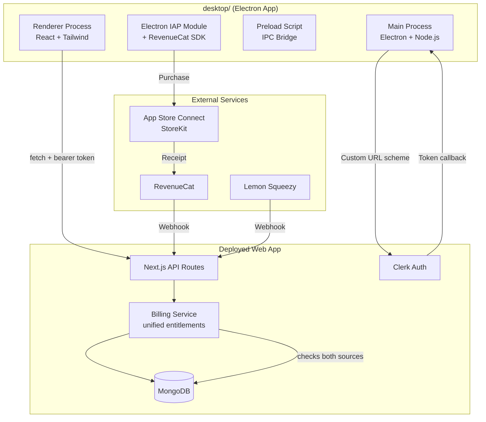

# Implementation Plan — DevMockView macOS Desktop App (Electron)

## Problem Statement

You have a production-ready Next.js web app for AI-powered mock interviews and want a native-feeling macOS desktop client (distributed via the Mac App Store) that communicates with the same deployed backend API. Subscriptions must use Apple IAP (via RevenueCat) on the Mac App Store, unified with Lemon Squeezy subscriptions from the web.

## Requirements

- Electron app living in a `desktop/` folder within the existing monorepo
- macOS-native look and feel: sidebar navigation for dashboard/history, immersive full-window for interview sessions
- System browser OAuth flow for Clerk authentication (custom URL scheme callback)
- Reuse of existing API endpoints (no backend changes needed except billing unification)
- Apple In-App Purchase via RevenueCat for Mac App Store subscriptions
- Unified entitlements: web (Lemon Squeezy) + Mac (Apple IAP) both grant access
- Web Audio API for STT (Deepgram WebSocket) and TTS playback
- Polish from day one — ready for Mac App Store submission

## Background (API Surface)

The Mac app will consume these existing endpoints (all require Clerk bearer token):

| Endpoint | Method | Purpose |
|----------|--------|---------|
| `/api/jd/parse` | POST | Parse job description, create session |
| `/api/session/turn` | POST | Interview turns (SSE streaming) |
| `/api/session/tts` | POST | Text-to-speech audio stream |
| `/api/session/feedback` | POST | Generate feedback report |
| `/api/deepgram/token` | POST | Scoped STT token for WebSocket |
| `/api/billing/status` | GET | Current subscription tier/status |

New endpoint needed:

| Endpoint | Method | Purpose |
|----------|--------|---------|
| `/api/webhooks/revenuecat` | POST | RevenueCat server-to-server webhook for subscription events |

## Proposed Solution

## Entitlement Unification Strategy

- RevenueCat webhook fires on subscription events → updates user's `subscriptionTier` and `subscriptionSource: 'apple'` in MongoDB
- Lemon Squeezy webhook (existing) → updates with `subscriptionSource: 'lemonsqueezy'`
- `billingService.canCreateSession()` checks the active subscription regardless of source
- If a user has subscriptions from both sources, the higher tier wins
- RevenueCat's `app_user_id` is set to the Clerk user ID for cross-platform mapping

---

## Task Breakdown

### Task 1: Project scaffolding and Electron shell

**Objective:** Set up the `desktop/` project structure with Electron, React, TypeScript, and a working dev environment.

**Implementation guidance:**

- Create `desktop/` folder with its own `package.json`, `tsconfig.json`
- Set up Electron main process (`src/main/main.ts`) with a basic BrowserWindow
- Set up React renderer with Vite (fast HMR for development)
- Configure electron-builder for macOS builds (`.dmg` and `.mas` targets)
- Add scripts: `dev` (concurrent Vite + Electron), `build`, `package`
- Configure the custom URL scheme (`devmockview://`) in Electron's app manifest

**Test requirements:**

- App launches and displays a blank React page
- Hot reload works in development
- `npm run package` produces a working `.app` bundle

**Demo:** Electron window opens with a "Hello DevMockView" React page. Dev mode has hot reload.

---

### Task 2: macOS-native window chrome and layout shell

**Objective:** Implement the sidebar + content area layout with native macOS styling.

**Implementation guidance:**

- Configure `BrowserWindow` with `titleBarStyle: 'hiddenInset'` (traffic-light buttons inset into content)
- Set up vibrancy/translucent material on the sidebar panel
- Build the layout shell: fixed-width sidebar (220px) + flexible content area
- Sidebar items: Dashboard, New Interview, History, Settings (icons + labels)
- Use system font stack (`-apple-system, BlinkMacSystemFont, SF Pro`)
- Add `⌘,` for Settings, `⌘N` for New Interview keyboard shortcuts via Electron menu
- Set minimum window size (900×600), remember window position/size between launches

**Test requirements:**

- Sidebar renders with correct items, content area shows placeholder per route
- Keyboard shortcuts trigger navigation
- Window remembers its size/position on relaunch

**Demo:** A native-feeling Mac window with translucent sidebar, traffic-light buttons, and functional navigation between placeholder views.

---

### Task 3: Authentication — system browser OAuth flow with Clerk

**Objective:** Implement secure sign-in via the system browser with token persistence.

**Implementation guidance:**

- On "Sign in" click, open the default browser to your Clerk sign-in URL with a redirect URI of `devmockview://auth/callback`
- Register the custom URL scheme handler in Electron's main process (`app.setAsDefaultProtocolClient`)
- On callback, extract the session token from the URL parameters
- Use Clerk's Frontend API to exchange the code for a session token (PKCE flow)
- Store the session token securely in macOS Keychain via `safeStorage` (Electron's encrypted storage API)
- Expose auth state to the renderer via IPC (`getToken`, `isAuthenticated`, `signOut`)
- Auto-refresh tokens before expiry using Clerk's token refresh endpoint
- Handle sign-out: clear Keychain, reset app state, show sign-in screen

**Test requirements:**

- Sign-in opens system browser, callback returns to app with valid token
- Token persists across app restarts (Keychain storage)
- Expired tokens are refreshed automatically
- Sign-out clears all credentials

**Demo:** User clicks "Sign in", browser opens Clerk login, after authenticating they're redirected back to the app in an authenticated state. Restarting the app preserves the session.

---

### Task 4: API client layer with bearer token auth

**Objective:** Build a typed API client that all renderer components use to communicate with the deployed backend.

**Implementation guidance:**

- Create `src/renderer/api/client.ts` — a thin wrapper around `fetch` that:
  - Prepends the production API base URL (configurable for dev/prod)
  - Attaches the bearer token from the auth layer to every request
  - Handles 401 responses by triggering re-auth flow
  - Provides typed methods: `jdParse()`, `sessionTurn()`, `sessionTTS()`, `sessionFeedback()`, `deepgramToken()`, `billingStatus()`
- Create an SSE helper for consuming the `/api/session/turn` streaming response
- Create TypeScript interfaces matching the API response shapes

**Test requirements:**

- Unit tests for the API client (mock fetch, verify headers/URLs)
- SSE parser correctly handles multi-chunk streaming responses
- 401 handling triggers sign-out flow

**Demo:** From the renderer, successfully call `billingStatus()` and display the user's current tier in the sidebar footer.

---

### Task 5: RevenueCat integration — client-side (Electron IAP)

**Objective:** Implement in-app purchase flow using RevenueCat's SDK within Electron.

**Implementation guidance:**

- Set up RevenueCat project in their dashboard:
  - Create app (Apple platform)
  - Set `app_user_id` to Clerk user ID (for cross-platform entitlement mapping)
  - Create 3 products mirroring your tiers: Starter, Pro, Premium (auto-renewable subscriptions)
  - Configure entitlements: `starter_access`, `pro_access`, `premium_access`
- In App Store Connect:
  - Create the 3 subscription products (same pricing as Lemon Squeezy equivalents)
  - Set up a subscription group
  - Configure sandbox testers for testing
- In the Electron app:
  - Use `@revenuecat/purchases-js` (RevenueCat's web/JS SDK) or Electron's `inAppPurchase` module + RevenueCat REST API
  - On app launch (after auth), identify the user with RevenueCat using their Clerk user ID: `Purchases.logIn(clerkUserId)`
  - Fetch available packages/offerings from RevenueCat
  - Present subscription options in a native-feeling purchase UI
  - Handle purchase flow: initiate → Apple payment sheet → receipt validation → entitlement active
  - Handle restore purchases (required by Apple)
  - Sync subscription status to local state for immediate UI updates

**Test requirements:**

- Products load correctly from RevenueCat
- Sandbox purchases complete successfully
- Restore purchases works
- Subscription status reflects in the app immediately after purchase
- User identified correctly with Clerk ID

**Demo:** User can view subscription offerings, complete a sandbox purchase via the Apple payment sheet, and see their tier update immediately in the app.

---

### Task 6: RevenueCat integration — server-side (webhook + billing unification)

**Objective:** Add a RevenueCat webhook endpoint and unify billing logic to check both Lemon Squeezy and Apple subscriptions.

**Implementation guidance:**

- Create `app/api/webhooks/revenuecat/route.ts`:
  - Verify webhook signature (RevenueCat provides an authorization header)
  - Handle events: `INITIAL_PURCHASE`, `RENEWAL`, `CANCELLATION`, `EXPIRATION`, `BILLING_ISSUE`
  - Extract `app_user_id` (Clerk user ID) from the event payload
  - Map RevenueCat product IDs to your tier names (Starter/Pro/Premium)
  - Update user document: `subscriptionTier`, `subscriptionStatus`, `subscriptionSource: 'apple'`, `revenuecatSubscriptionId`
- Update `billingService`:
  - `canCreateSession()` already reads tier from the user document — no change needed if you write to the same fields
  - Add logic: if user has active subscriptions from both sources, use the higher tier
  - Add a `getSubscriptionSource()` helper so the UI can show "via App Store" or "via web"
- Update User model to include optional `subscriptionSource` and `revenuecatSubscriptionId` fields
- Register the webhook URL in RevenueCat dashboard: `https://<domain>/api/webhooks/revenuecat`

**Test requirements:**

- Webhook correctly processes all event types
- Signature verification rejects invalid requests
- User tier syncs correctly after purchase/renewal/cancellation
- `canCreateSession()` works regardless of subscription source
- If user has both sources, higher tier wins

**Demo:** Complete a sandbox purchase on the Mac app → RevenueCat webhook fires → user's tier updates in MongoDB → `billingStatus` API returns the correct tier → web app also reflects the new tier.

---

### Task 7: Dashboard view

**Objective:** Build the main dashboard screen showing session history, scores, and subscription status.

**Implementation guidance:**

- Create a dashboard component that calls `billingStatus()` and displays tier info
- Show subscription source ("via App Store" or "via Web") for clarity
- Display score trend chart (lightweight charting lib like Recharts or custom SVG)
- Show remaining sessions in the current billing period
- Style with Tailwind — clean, spacious, macOS-native feel (cards with subtle shadows, rounded corners)
- "Manage Subscription" button:
  - If Apple subscription → deep-link to App Store subscription management
  - If Lemon Squeezy → open customer portal in browser
  - If free → show upgrade options (triggers Task 5's purchase flow)

**Test requirements:**

- Dashboard renders loading → data states correctly
- Score chart displays with mock data
- Subscription management opens correct destination based on source
- Upgrade triggers IAP flow for Mac App Store users

**Demo:** After signing in, the dashboard shows the user's tier (with source), session count, and score history. Upgrade button triggers the Apple payment sheet.

---

### Task 8: New Interview flow — JD input and setup review

**Objective:** Build the job description input and session setup screens.

**Implementation guidance:**

- JD Input screen: large textarea for pasting job description, "Analyze" button
- Calls `POST /api/jd/parse` with the JD text
- Loading state while LLM processes (can take 5-10 seconds)
- Setup Review screen: displays extracted signals (role, company, skills, focus areas)
- Allow user to confirm or go back and re-paste
- On confirm, store the `sessionId` in app state and navigate to mic check
- Handle session cap: if `canCreateSession` returns false, show upgrade prompt (triggers IAP)
- Design: clean, focused single-column layout with clear step indicators

**Test requirements:**

- JD submission calls API correctly with bearer token
- Extracted signals display properly
- Error states handled (API failure, rate limit, session cap reached)
- Session cap exceeded → shows upgrade option via Apple IAP

**Demo:** User pastes a job description, app extracts interview signals and shows them for review. User confirms and proceeds.

---

### Task 9: Mic check screen

**Objective:** Verify microphone access and audio quality before starting the interview.

**Implementation guidance:**

- Request microphone permission via `navigator.mediaDevices.getUserMedia()`
- Display real-time audio level meter (reuse logic from `AudioLevelMeter.tsx`)
- Show a "Speak a test phrase" prompt so user can verify their mic works
- Display the detected audio device name
- "Start Interview" button (disabled until mic is confirmed working)
- Handle permission denied gracefully with instructions to fix it in System Preferences → Privacy & Security → Microphone
- Electron-specific: add microphone entitlement in `entitlements.mas.plist` for Mac App Store

**Test requirements:**

- Mic permission request works in Electron
- Audio level meter responds to speech
- Permission denied shows helpful error message

**Demo:** User sees their microphone level responding in real-time, confirms it works, and clicks "Start Interview."

---

### Task 10: Voice consent gate

**Objective:** Implement the voice recording consent flow (legal requirement) before first interview.

**Implementation guidance:**

- Before the first interview session, show a consent dialog explaining:
  - Audio is captured for real-time transcription only
  - What data is stored vs. discarded
  - User's rights to withdraw consent
- Consent must be granted before mic access is requested
- Store consent state locally (and eventually POST to server for durable proof)
- Match the consent version from `LEGAL.consentVersion` in `lib/site.ts`
- If consent was previously granted (and version hasn't changed), skip the gate

**Test requirements:**

- Consent dialog appears on first interview attempt
- Accepting allows interview to proceed
- Declining blocks interview with a clear explanation
- Consent persists across app restarts

**Demo:** First-time user attempting an interview sees a clear consent dialog. After accepting, they proceed to mic check. On subsequent launches, the gate is skipped.

---

### Task 11: Interview session — core loop (STT + turn API + TTS)

**Objective:** Build the immersive interview experience with real-time speech processing.

**Implementation guidance:**

- When entering interview mode, collapse the sidebar for an immersive full-window experience
- Implement the turn loop (matches web app logic):
  1. `loading` → call `/api/session/turn` with `__START__`
  2. `asking` → play question audio via `/api/session/tts` (Web Audio API)
  3. `listening` → capture speech via Deepgram WebSocket (reuse `useSTT` hook logic)
  4. `thinking` → send transcript to `/api/session/turn`, parse SSE response
  5. Repeat until `decision.action === 'end'`
  6. `done` → show completion state
- Display: current question text, question type chip, live transcript, phase indicators
- Controls: "Done answering" button, "End interview" escape hatch
- Visual polish: subtle animations for phase transitions, pulsing dot for "thinking"

**Test requirements:**

- Full turn loop works end-to-end against the live API
- SSE streaming parsed correctly in Electron's renderer
- Audio playback and mic capture work simultaneously without feedback
- "End interview" sends `__ABANDON__` and returns to dashboard

**Demo:** User completes a full 2-3 question interview with real-time speech recognition, AI-generated questions, and TTS playback.

---

### Task 12: Feedback report view

**Objective:** Display the post-interview feedback report with scores and per-question breakdown.

**Implementation guidance:**

- After interview completion, call `POST /api/session/feedback`
- Display overall scores (communication, technical depth, structure, etc.)
- Show per-question breakdown: question text, user's answer summary, score, feedback
- Score visualization: circular progress indicators or bar charts
- "Practice again" CTA → navigates back to New Interview
- "Back to Dashboard" → returns to main view with sidebar

**Test requirements:**

- Feedback report renders all score categories
- Handles loading state (report generation can take a few seconds)
- Navigation back to dashboard works

**Demo:** After completing an interview, user sees a detailed feedback report with scores and actionable feedback for each question.

---

### Task 13: Settings and account management

**Objective:** Build the settings screen with account info and subscription management.

**Implementation guidance:**

- Display user info (name, email from Clerk)
- Show current subscription tier, status, and source (App Store vs Web)
- Subscription actions:
  - If subscribed via Apple: "Manage Subscription" → opens macOS subscription settings
  - If subscribed via Lemon Squeezy: "Manage Subscription" → opens LS portal in browser
  - If free: "Upgrade" → shows RevenueCat offerings and triggers IAP
- "Restore Purchases" button (Apple requirement — calls `Purchases.restorePurchases()`)
- "Sign out" button with confirmation
- App preferences: audio input device selection (future)
- About section: app version, links to Terms/Privacy (open in browser)

**Test requirements:**

- User info displays correctly
- Restore purchases works in sandbox
- Sign out clears state and returns to sign-in screen
- External links open in system browser

**Demo:** Settings screen shows account details, tier info with source, working restore purchases, and sign-out flow.

---

### Task 14: Mac App Store packaging and submission prep

**Objective:** Configure electron-builder for Mac App Store submission with proper entitlements and signing.

**Implementation guidance:**

- Set up code signing with your Apple Developer certificate (Developer ID + Mac App Store distribution)
- Configure `entitlements.mas.plist`:
  - `com.apple.security.app-sandbox` (required)
  - `com.apple.security.device.audio-input` (microphone)
  - `com.apple.security.network.client` (API calls + WebSocket)
  - `com.apple.security.keychain-access-groups` (token storage)
- Configure app icon (`.icns` format, all required sizes)
- Add `LSApplicationCategoryType`: `public.app-category.education`
- Set up Hardened Runtime
- Create `electron-builder` config for MAS target (`mas` + `mas-dev` for testing)
- Test with `mas-dev` build on your machine before submission
- App Store listing metadata:
  - Description, keywords, screenshots (at least 1280×800)
  - Privacy nutrition labels (data collected: name, email, audio — linked to identity)
  - App Review notes explaining the OAuth flow and microphone usage
- Submit via Transporter or `xcrun altool`

**Test requirements:**

- `npm run package:mas` produces a signed `.pkg` for Mac App Store
- App passes `codesign --verify` and `spctl --assess`
- Sandboxed app still has microphone, network, and Keychain access
- Custom URL scheme works in sandboxed environment
- IAP works in sandbox environment

**Demo:** A signed, sandboxed `.pkg` that installs and runs correctly with working IAP, ready for App Store review submission.

---

### Task 15: End-to-end testing and polish pass

**Objective:** Full QA pass, performance optimization, and visual polish before submission.

**Implementation guidance:**

- Test the complete flow: sign in → dashboard → upgrade (IAP) → new interview → JD paste → mic check → consent → interview → feedback → dashboard
- Test edge cases: network failures mid-interview, token expiry during session, mic disconnection, IAP interrupted
- Test subscription scenarios: new purchase, renewal, cancellation, expiry, restore, cross-platform (subscribe on web → verify on Mac, vice versa)
- Performance: ensure smooth 60fps animations, no memory leaks during long sessions
- Visual polish: consistent spacing, hover states, focus rings for keyboard navigation, reduced-motion support
- Add app menu items (Edit menu with copy/paste for text fields, Window menu)
- Add a loading/splash screen on cold start
- Test on both Intel and Apple Silicon Macs
- Verify App Store Review Guidelines compliance:
  - No external payment links that bypass IAP
  - Restore purchases works
  - Privacy labels accurate

**Test requirements:**

- Full flow completes without errors on M1+ and Intel Macs
- No accessibility violations (VoiceOver navigation works)
- Memory usage stays stable during multi-question interviews
- Graceful degradation on network issues
- Cross-platform subscription sync works correctly

**Demo:** Complete, polished app experience from first launch through purchase, multiple interview sessions, and subscription management — ready for App Store review.
